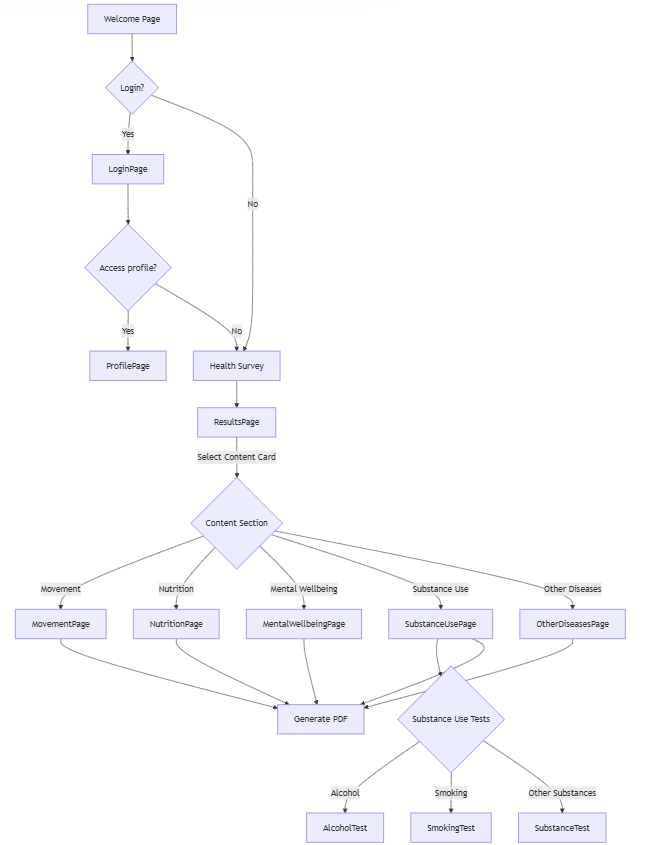

# PIRHA Rehabilitation Guide 


A React-based web application providing a rehabilitation guide for Pirkanmaan hyvinvointialue (PIRHA). This guide offers personalized health information based on survey responses.

## 🌟 Features

*   Interactive personalized health survey
*   Detailed content sections (movement, nutrition, mental wellbeing, substance use, other diseases)
*   Personalized content based on survey answers
*   Real-time PDF generation for content sections, with personalized content
*   Data persistence using `localStorage` for survey answers and progress
*   Progress tracking with visual indicators and a side bar tracker
*   Error handling with `react-error-boundary`
*   Mobile-responsive design
*   Finnish language, with Swedish translation created for welcome page and survey page for demonstration purposes *

#### *The Swedish translations have been created by Google translate and revised by ChatGPT.


## 🚀 **Quick Start**

### **Prerequisites**
- Node.js 18+ 
- pnpm 

### Installation

```bash
# 1. Install dependencies
pnpm install

# 2. Start development server
pnpm dev
```
#### Application will be available at http://localhost:5173


## 📚 Technology Stack

| Category | Technology | Version |
|----------|------------|---------|
| **Framework** | React | 19.1.0 | 
| **Build Tool** | Vite | 6.3.5 | 
| **Styling** | Tailwind CSS | 4.1.7 |
| **UI Components** | Radix UI | Latest | 
| **PDF Generation** | jsPDF | 2.5.2 |
| **Canvas Rendering** | html2canvas | 1.4.1 | 
| **Error Handling** | react-error-boundary | 4.1.2 | 
| **Icons** | Lucide React | 0.510.0 | 
| **Animations** | Framer Motion | 12.15.0 |

## 🗂️ Project Structure

```
pirha-rehabilitation-guide/
├── src/
│   ├── assets/
│   │   └── react.svg
│   ├── components/
│   │   ├── ui/
│   │   │   ├── accordion.jsx
│   │   │   ├── alert-dialog.jsx
│   │   │   ├── alert.jsx
│   │   │   └── ... (many components)
│   │   ├── AlcoholTest.jsx
│   │   ├── AllContentPage.jsx
│   │   ├── ErrorBoundary.tsx
│   │   ├── Header.jsx
│   │   ├── LanguageSwitcher.jsx
│   │   ├── LoginPage.jsx
│   │   ├── MentalWellbeingPage.jsx
│   │   ├── MovementPage.jsx
│   │   ├── NutritionPage.jsx
│   │   ├── OtherDiseasesPage.jsx
│   │   ├── PersonalizationIndicator.jsx
│   │   ├── ProfilePage.jsx
│   │   ├── ProgressTracker.jsx
│   │   ├── ResultsPage.jsx
│   │   ├── SmokingTest.jsx
│   │   ├── SubstanceTest.jsx
│   │   └── SubstanceUsePage.jsx
│   ├── hooks/
│   │   └── use-mobile.js
│   ├── lib/
│   │   └── utils.js
│   ├── locales/
│   │   ├── fi/
│   │   │   └── translation.json
│   │   └── sv/
│   │       └── translation.json
│   ├── utils/
│   │   ├── dataStorage.js
│   │   ├── pdfGenerator.js
│   │   └── userProfile.js
│   ├── App.css
│   ├── App.jsx
│   ├── i18n.js
│   ├── index.css
│   └── main.jsx
└── Configuration files
```

## 📱 Application Flow




## 🎨 Content Sections

| Section | Coverage | PDF Form |
|---------|----------|-----------|
| **Liikkuminen** | Exercise recommendations | Exercise plan |
| **Ravitsemus** | Nutrition guidelines | Meal plan |
| **Henkinen jaksaminen** | Mental health support | Wellness tracker |
| **Päihteiden käyttö** | Smoking cessation, alcohol reduction and substance use quitting | Usage tracker |
| **Muut sairaudet** | Chronic disease management | Health monitor |


## 📄 License

MIT License - See LICENSE file for details.
